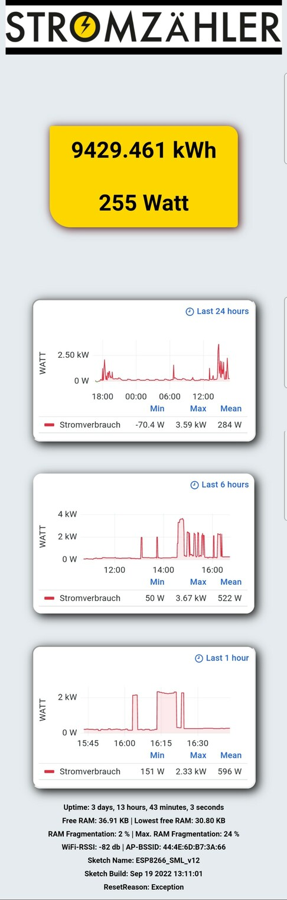

#  MT691_to_InfluxDB

An **ESP8266** program for obtaining data from a **MT691** and saving it to an **InfluxDB**.

#  Features

 - Reads the data from the smartmeter every second
 - Sends the last value to InfluxDB every minute
 - Buffers data if no WiFi is available (up to 800 records)
 - Webpage with Grafana plugin and ESP monitoring
 - Telnet for monitoring

